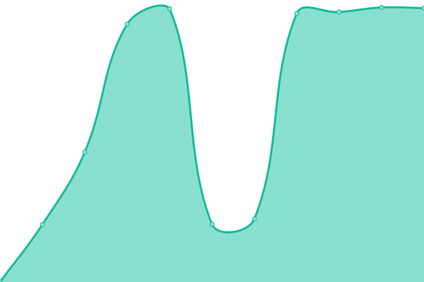

# [📈 Live Status](https://soramitsukhmer.github.io/upptime): <!--live status--> **🟧 Partial outage**

This repository contains the open-source uptime monitor and status page for [Soramitsu Khmer](https://soramitsu.co.jp/kh), powered by [Upptime](https://github.com/upptime/upptime).

With [Upptime](https://upptime.js.org), you can get your own unlimited and free uptime monitor and status page, powered entirely by a GitHub repository. We use [Issues](https://github.com/soramitsukhmer/upptime/issues) as incident reports, [Actions](https://github.com/soramitsukhmer/upptime/actions) as uptime monitors, and [Pages](https://soramitsukhmer.github.io/upptime) for the status page.

<!--start: status pages-->
<!-- This summary is generated by Upptime (https://github.com/upptime/upptime) -->
<!-- Do not edit this manually, your changes will be overwritten -->
<!-- prettier-ignore -->
| URL | Status | History | Response Time | Uptime |
| --- | ------ | ------- | ------------- | ------ |
|  [Fast Development](https://web-fast-dev.sorakh.app/) | 🟩 Up | [fast-development.yml](https://github.com/soramitsukhmer/upptime/commits/HEAD/history/fast-development.yml) | 

 844ms
     
 | 

<a href="https://upptime.soramitsukhmer.com/history/fast-development">100.00%</a>
    

|  [Fast Integration](https://web-fast-integration.sorakh.app/) | 🟩 Up | [fast-integration.yml](https://github.com/soramitsukhmer/upptime/commits/HEAD/history/fast-integration.yml) | 

 811ms
     
 | 

<a href="https://upptime.soramitsukhmer.com/history/fast-integration">100.00%</a>
    

|  [Fast NBC](https://web-fast-nbc.sorakh.app/) | 🟩 Up | [fast-nbc.yml](https://github.com/soramitsukhmer/upptime/commits/HEAD/history/fast-nbc.yml) | 

 899ms
     
 | 

<a href="https://upptime.soramitsukhmer.com/history/fast-nbc">100.00%</a>
    

|  [NCS Development](https://web-ncs-dev.sorakh.app/) | 🟩 Up | [ncs-development.yml](https://github.com/soramitsukhmer/upptime/commits/HEAD/history/ncs-development.yml) | 

 845ms
     
 | 

<a href="https://upptime.soramitsukhmer.com/history/ncs-development">100.00%</a>
    

|  [NCS Integration](https://web-ncs-integration.sorakh.app/) | 🟥 Down | [ncs-integration.yml](https://github.com/soramitsukhmer/upptime/commits/HEAD/history/ncs-integration.yml) | 

 0ms
     
 | 

<a href="https://upptime.soramitsukhmer.com/history/ncs-integration">0.00%</a>
    

|  [NCS NBC](https://web-ncs-nbc.sorakh.app/) | 🟥 Down | [ncs-nbc.yml](https://github.com/soramitsukhmer/upptime/commits/HEAD/history/ncs-nbc.yml) | 

 3795ms
     
 | 

<a href="https://upptime.soramitsukhmer.com/history/ncs-nbc">0.00%</a>
    

<!--end: status pages-->

[**Visit our status website →**](https://soramitsukhmer.github.io/upptime)

## 📄 License

- Powered by: [Upptime](https://github.com/upptime/upptime)
- Code: [MIT](./LICENSE) © [Soramitsu Khmer](https://soramitsu.co.jp/kh)
- Data in the `./history` directory: [Open Database License](https://opendatacommons.org/licenses/odbl/1-0/)
